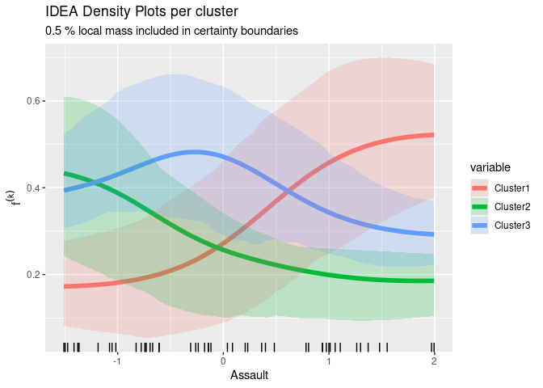

<!-- README.md is generated from README.Rmd. Please edit that file -->

# FACT - (Feature Attributions for Clustering)

<!-- badges: start -->
<!-- badges: end -->

To get value from a clustering algorithm, it is important to understand
the mapping procedure of an algorithm that assigns instances to
clusters. FACT is an algorithm agnostic framework that provides feature
attribution while preserving the integrity of the data.

## Features

- `SMART` (Scoring Metric After Permutation) permutes feature sets to
  measure the sensitivity of algorithms to changes in cluster
  assignments.
- `IDEA` (Isolated Effect on Assignment) visualizes local and global
  changes in cluster assignments over one- and two-dimensional feature
  spaces.

## Installation

You can install the development version of `FACT` like so:

``` r
# Development version
remotes::install_github("henrifnk/FACT")
```

## Quickstart

We aim to divide American states by their standardized crime rates in 3
clusters.

``` r
library(FACT)
library(mlr3cluster)
#> Lade nötiges Paket: mlr3
attributes_scale = attributes(scale(USArrests))
```

|            | Murder | Assault | UrbanPop |  Rape |
|:-----------|-------:|--------:|---------:|------:|
| Alabama    |   1.24 |    0.78 |    -0.52 |  0.00 |
| Alaska     |   0.51 |    1.11 |    -1.21 |  2.48 |
| Arizona    |   0.07 |    1.48 |     1.00 |  1.04 |
| Arkansas   |   0.23 |    0.23 |    -1.07 | -0.18 |
| California |   0.28 |    1.26 |     1.76 |  2.07 |
| Colorado   |   0.03 |    0.40 |     0.86 |  1.86 |

USArrests Data Set

Therefore, we use a c-means algorithm from `mlr3cluster`.

``` r
tsk_usa = TaskClust$new(id = "usarest", backend = data.frame(scale(USArrests)))
c_lrn = lrn("clust.cmeans", centers = 3, predict_type = "prob")
c_lrn$train(tsk_usa)
```

Then, we create a `ClustPredictor` that wraps the information needed for
our methods.

``` r
predictor = ClustPredictor$new(c_lrn, data = tsk_usa$data(), y = c_lrn$model$membership)
```

How does `Assault` effect the partitions created by `c-means`
clustering?

The `sIDEA` plot shows:

- **x-Axis**: The domain in the feature space of `Assault` were
  realizations of observations can be found (visualized by the
  `geom_rug`).
- **y-Axis**: The associated soft labels score of cluster k, `f(k)`.
- **solid line**: The estimated marginal, global effect of a cluster k
  over the feature space.
- **transparent area**: 50% of the mass of the individual effects. This
  area represents the variance of the effects across feature space.

``` r
idea_assault = IDEA$new(predictor, "Assault", grid.size = 50)
idea_assault$plot_globals(0.5)
```



**Short Interpretation:**

- States in cluster 1 (red) are marginally associated with the lowest
  `Assault` rate.
- States in cluster 3 (blue) are marginally associated with a relatively
  low `Assault` rate.
- States in cluster 2 (green) are marginally associated with a
  relatively high `Assault` rate.

# Citation

If you use `FACT` in a scientific publication, please
[cite](https://doi.org/10.1007/978-3-031-44064-9_13) it as:

    Scholbeck, C.A., Funk, H., Casalicchio, G. (2023). Algorithm-Agnostic Feature Attributions for Clustering. In: Longo, L. (eds) Explainable Artificial Intelligence. xAI 2023. Communications in Computer and Information Science, vol 1901. Springer, Cham. https://doi.org/10.1007/978-3-031-44064-9_13

BibTeX:

``` tex
@InProceedings{10.1007/978-3-031-44064-9_13,
author="Scholbeck, Christian A.
and Funk, Henri
and Casalicchio, Giuseppe",
editor="Longo, Luca",
title="Algorithm-Agnostic Feature Attributions for Clustering",
booktitle="Explainable Artificial Intelligence",
year="2023",
publisher="Springer Nature Switzerland",
address="Cham",
pages="217--240",
abstract="Understanding how assignments of instances to clusters can be attributed to the features can be vital in many applications. However, research to provide such feature attributions has been limited. Clustering algorithms with built-in explanations are scarce. Common algorithm-agnostic approaches involve dimension reduction and subsequent visualization, which transforms the original features used to cluster the data; or training a supervised learning classifier on the found cluster labels, which adds additional and intractable complexity. We present FACT (feature attributions for clustering), an algorithm-agnostic framework that preserves the integrity of the data and does not introduce additional models. As the defining characteristic of FACT, we introduce a set of work stages: sampling, intervention, reassignment, and aggregation. Furthermore, we propose two novel FACT methods: SMART (scoring metric after permutation) measures changes in cluster assignments by custom scoring functions after permuting selected features; IDEA (isolated effect on assignment) indicates local and global changes in cluster assignments after making uniform changes to selected features.",
isbn="978-3-031-44064-9"
}
```
